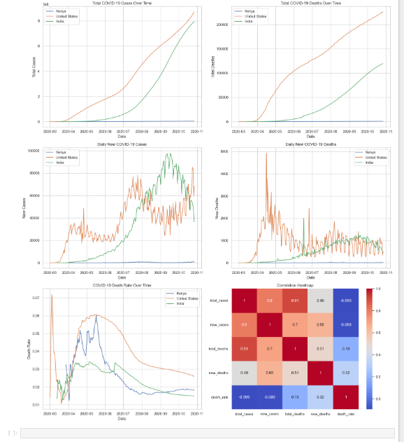
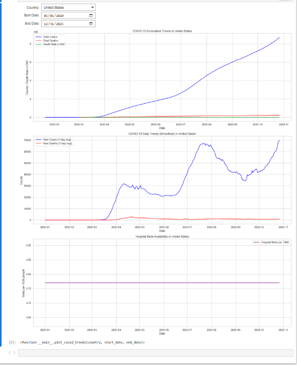

# COVID-19 Global Data Tracker


## Project Overview
The COVID-19 Global Data Tracker is a Jupyter Notebook project designed to monitor and analyze the worldwide impact of the COVID-19 pandemic.  
It uses real-world datasets from Our World in Data (OWID) to visualize trends in:

- Total cases
- Total deaths
- Daily new cases and deaths
- Death rates
- Optional hospitalization metrics

The notebook includes **interactive widgets** for selecting countries and date ranges, making the analysis dynamic and user-friendly.

---

## Project Objectives
- Load and clean the global COVID-19 dataset (`owid-covid-data.csv`)  
- Explore and visualize time trends in cases, deaths, and death rates  
- Compare COVID-19 metrics across countries and date ranges  
- Implement interactive features for **user-selected analysis**  
- Highlight anomalies, interesting patterns, and key insights  

---

## Tools & Libraries
- Python 3.10  
- pandas (data loading and cleaning)  
- matplotlib & seaborn (visualizations)  
- ipywidgets (interactive country/date selection)  
- Jupyter Notebook (analysis and reporting)

---

## How to Run / View the Project
1. Clone the repository:
```bash
git clone https://github.com/yourusername/covid19-data-tracker.git
```
2. Navigate to the project folder and open the notebook:
```bash
cd covid19-data-tracker
jupyter notebook covid_tracker.ipynb
```
3. Run all cells in the notebook.
4. Use the interactive widgets to select a country and date range for analysis.

Project Demo

Here’s a preview of the interactive notebook:
  


## Insights & Reflections
- Some days show zero new cases or deaths followed by sudden jumps, likely due to reporting delays.  
- Forward-filling and interpolation smoothed cumulative metrics, but daily spikes remain visible.  
- Missing vaccination data is a structural anomaly, preventing analysis of vaccination rollout trends.  
- COVID-19 trends vary across countries, highlighting the importance of comparing regions interactively.
